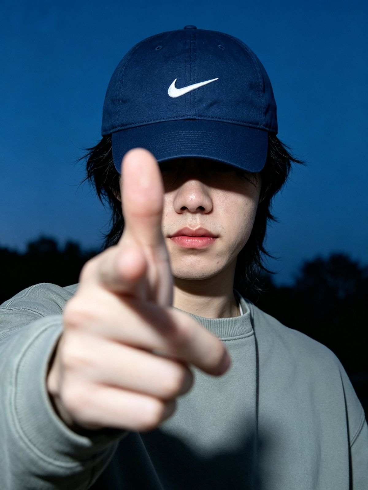

嗨，我是 Moose。白天调模型，晚上推雪橇。

最近手上的事有点多。我在做训练和运动相关的探索，也在做一个视觉语言模型网关。我还接了一些短剧的后期剪辑，也在试用各种前沿的 Agent 产品。

## 为什么开这个网站

接下来应该会做很多新的、好玩的内容和产品，我想给它们找一个固定的地方。所以我开了这个网站。它是我的作品集，也是一份随时更新的近况。朋友们想知道我最近在做什么，打开这个网站就能看到。

如果你想联系我、认识我，或者对我在做的东西感兴趣，这个网站上的内容会比别处更完整。

小红书我主要用来放效果展示。口播暂时还没条件做，要再等一段时间。过程和想法，我会写在这个网站上。

<PullQuote>爱好太多，要做的太多，好玩的太多。</PullQuote>

## 这里会写什么

整个网站只有一条时间线，四种东西混在一起：

- **长文**：完整的复盘和教程。
- **碎碎念**：几句话的随手记录。
- **训练日志**：每次训练的动作和成绩。
- **小红书笔记**：在小红书发过的内容，这里会留一张卡片，点进去回到原帖。

方向大概是五个：训练、AI、做产品、二次元、小红书。

## 最近在忙

- **训练**：我主要在为 HYROX 备赛。我也想开始练铁人三项，明年可能试试标铁（标准距离铁人三项）。
- **比赛**：接下来的比赛在首尔、广州、曼谷和万宁。排期很满。
- **在做的东西**：视觉语言模型网关、短剧后期、各种 Agent 产品的试用，进展都会陆续写成文章。

<Aside>《排球少年》我刚看完第三遍。</Aside>

最近在看的番是《无职转生》第三季和《黄泉的配对》。

## 怎么找到我

- **订阅**：页面底部有 RSS。
- **小红书**：主要放效果展示，账号链接稍后补上。

先写到这里。接下来要做的事、要去的比赛、看完的番，都会出现在这条时间线上。
